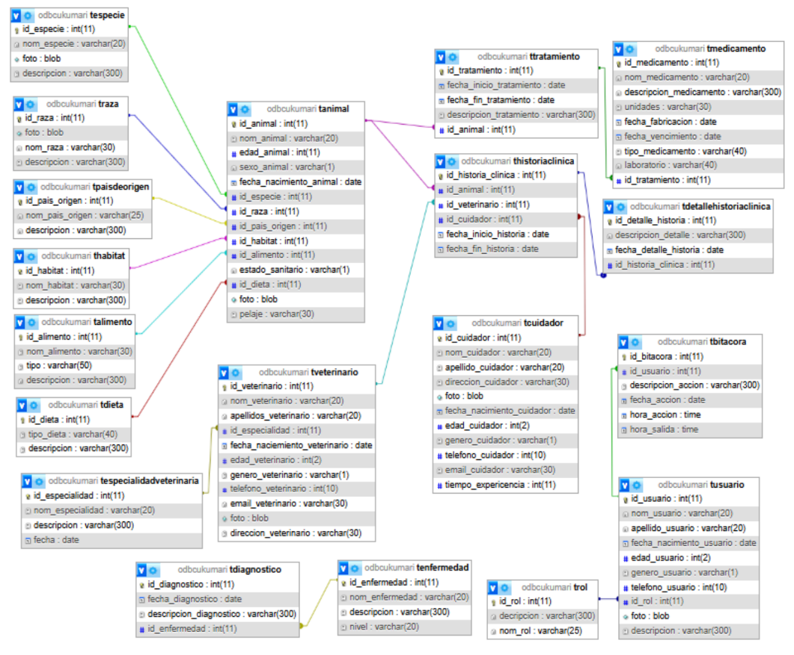

# 🦁 Sistema de Base de Datos: Clínica Veterinaria de Zoológico

Este proyecto presenta el diseño detallado y la implementación de una base de datos relacional robusta para la gestión integral de una clínica veterinaria dentro de un entorno de zoológico.

## 📊 Resumen Arquitectónico
El modelo consta de **19 tablas normalizadas**, diseñadas para garantizar la integridad referencial y la optimización de consultas complejas.

## 🛠️ Herramientas Utilizadas
- **Motor de Base de Datos:** MySQL / MariaDB (vía XAMPP).
- **Lenguaje:** SQL (DDL, DML).
- **Entorno de Gestión:** MySQL Shell / phpMyAdmin.

## 📐 Diagrama Entidad-Relación (DER)
 

## 🚀 Puntos Clave del Diseño
- **Normalización:** Aplicación de las tres primeras formas normales (1NF, 2NF, 3NF) para evitar redundancia de datos.
- **Relaciones Complejas:** Implementación de relaciones 1:N y M:N (muchos a muchos) mediante tablas intermedias (ej: Relación entre Consultas y Medicamentos).
- **Integridad:** Uso estricto de llaves primarias (PK) y foráneas (FK) con acciones en cascada donde fue necesario.
